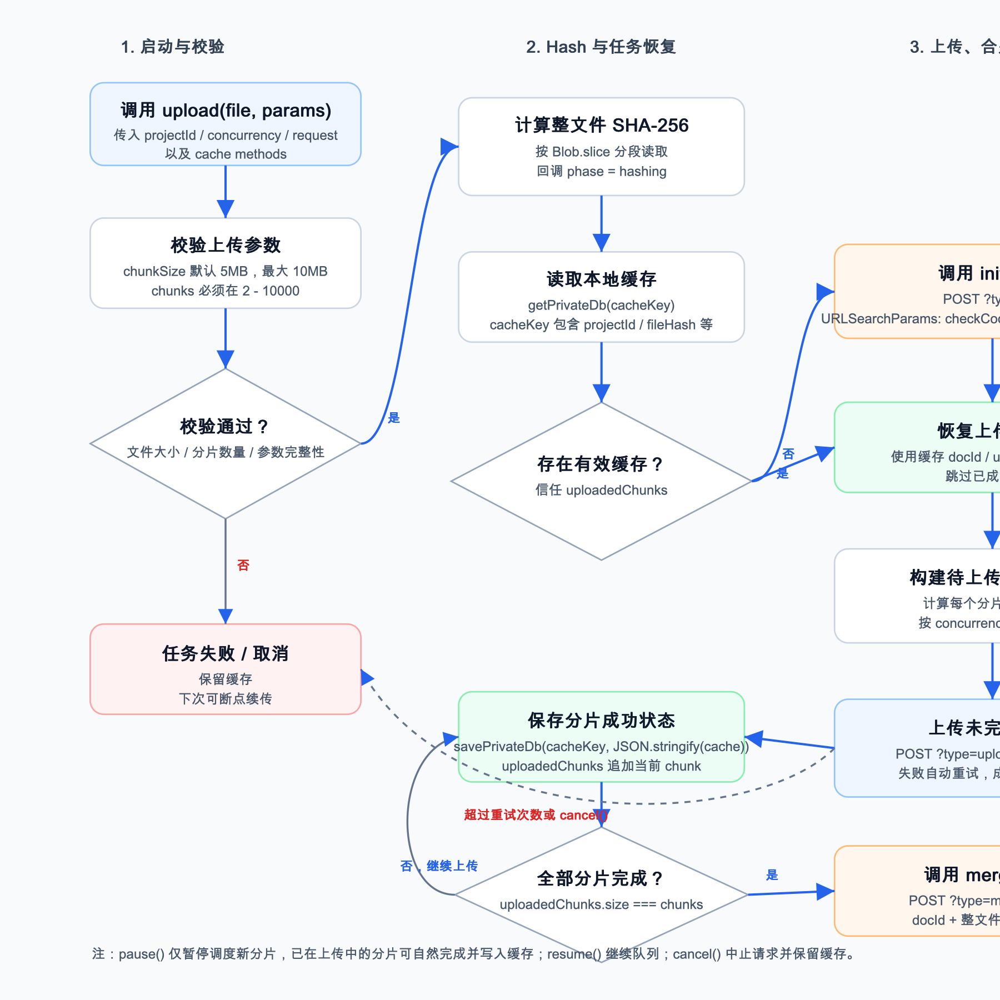
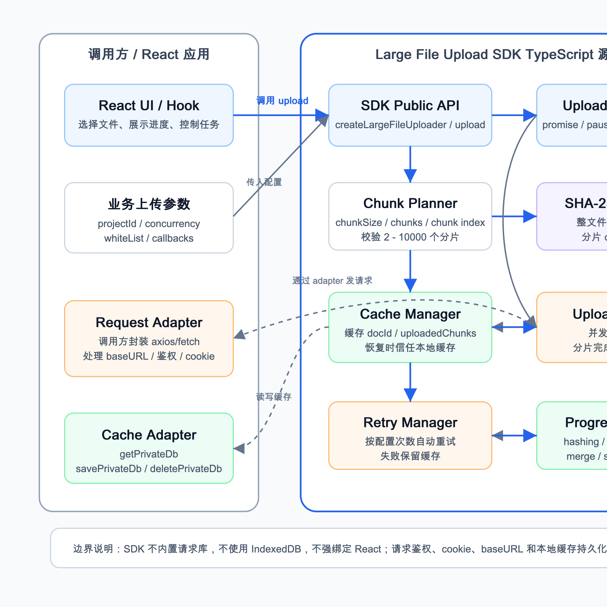
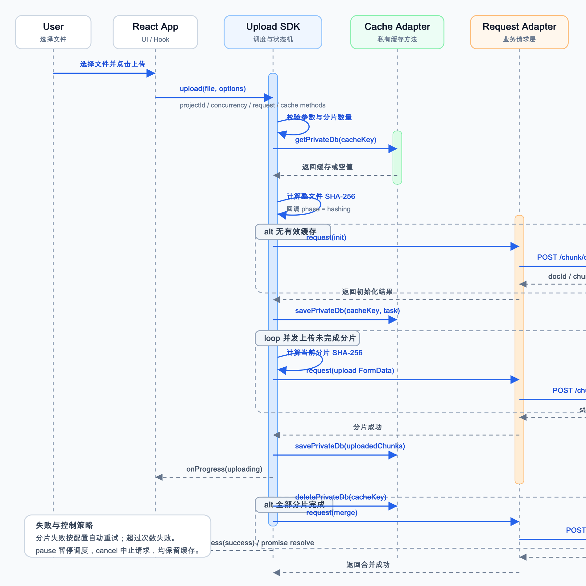

# 前端大文件上传 SDK 技术设计文档

## 1. 背景与目标

本文档描述一个面向 React 使用场景的前端大文件上传 SDK 技术方案。SDK 以 TypeScript 源码模块形式交付，负责文件分片、SHA-256 校验、断点续传、并发上传、进度回调、失败重试、暂停/恢复/取消等能力。

服务端提供三个接口：

- 初始化接口：`POST /projects/{project_id}/chunk/documents?type=init`
- 分片上传接口：`POST /projects/{project_id}/chunk/documents?type=upload`
- 分片合并接口：`POST /projects/{project_id}/chunk/documents?type=merge`

SDK 不内置请求库，不使用 IndexedDB。请求能力和缓存能力均由调用方注入。

## 2. SDK 能力范围

- 支持大文件分片上传。
- 支持刷新后的断点续传。
- 支持调用方配置并发分片数量。
- 支持分片级上传进度回调。
- 支持上传前计算整文件 SHA-256。
- 支持每个分片单独计算 SHA-256。
- 支持分片失败自动重试。
- 支持暂停、恢复、取消上传任务。
- 支持使用调用方注入的私有缓存方法保存上传状态。

## 3. 接口约定

### 3.1 调用方注入能力

```ts
type CacheGetter = (key: string) => Promise<unknown>;
type CacheSetter = (key: string, value: string) => Promise<void>;
type CacheDeleter = (key: string) => Promise<void>;

type RequestConfig = {
  url: string;
  method: 'POST';
  headers?: Record<string, string>;
  body: URLSearchParams | FormData | Record<string, unknown>;
  signal?: AbortSignal;
};

type RequestAdapter = <T>(config: RequestConfig) => Promise<{
  status: number;
  message: string;
  traceId?: string;
  result: T;
}>;
```

### 3.2 SDK 主要入口

```ts
const uploader = createLargeFileUploader({
  projectId,
  request,
  getPrivateDb,
  savePrivateDb,
  deletePrivateDb,
  concurrency,
});

const task = uploader.upload(file, {
  fileName,
  whiteList,
  chunkSize,
  maxRetries,
  onProgress,
});

task.pause();
task.resume();
task.cancel();
await task.promise;
```

## 4. 实现过程流程图

下图展示从用户选择文件到上传完成的完整 SDK 实现流程，包括参数校验、整文件 hash、缓存恢复、初始化、并发分片上传、缓存更新、合并以及异常保留缓存。



## 5. 架构设计图

下图展示调用方、SDK 内部模块、缓存适配器、请求适配器和服务端接口之间的边界关系。SDK 专注上传任务编排，鉴权、请求实现和缓存持久化由调用方负责。



## 6. 上传时序图

下图展示用户、React 应用、SDK、缓存适配器、请求适配器与三个服务端接口之间的调用顺序。



## 7. 关键设计说明

### 7.1 分片规则

- 默认分片大小为 `5MB`。
- 分片大小不超过 `10MB`。
- 分片序号从 `1` 开始。
- 分片数量范围为 `2-10000`。

### 7.2 SHA-256 校验

- 初始化和合并接口使用整文件 SHA-256。
- 分片上传接口使用当前分片 SHA-256。
- Hash 阶段纳入进度回调，便于 UI 展示完整上传生命周期。

### 7.3 请求适配

SDK 不直接依赖 `fetch`、`axios` 或其他请求库。调用方通过 `request` adapter 统一处理：

- `baseURL`
- cookie 鉴权
- headers
- 网关错误处理
- `AbortSignal`

## 8. 缓存与断点续传策略

SDK 使用调用方传入的三个异步缓存方法：

- `getPrivateDb(key)`
- `savePrivateDb(key, value)`
- `deletePrivateDb(key)`

缓存 key 建议包含：

```text
large-upload:{projectId}:{fileName}:{fileSize}:{lastModified}:{fileHash}
```

缓存内容建议包含：

```ts
type UploadCache = {
  docId: string;
  docVersion?: string;
  fileHash: string;
  fileName: string;
  fileSize: number;
  chunks: number;
  chunkSize: number;
  uploadedChunks: number[];
  createdAt: number;
  updatedAt: number;
};
```

恢复上传时，SDK 信任本地缓存中的 `uploadedChunks`，跳过已成功分片，只上传未完成分片。合并成功后删除缓存。

## 9. 异常与重试策略

- 分片上传失败后自动重试。
- 默认最大重试次数建议为 `3`。
- 超过重试次数后任务失败，并保留缓存。
- `pause()` 停止调度新的分片，已在上传中的分片可自然完成。
- `resume()` 继续调度剩余分片。
- `cancel()` 中止请求并停止任务，同时保留缓存，便于后续恢复。

## 10. 测试建议

- 首次上传完整成功。
- 上传一部分后刷新页面，恢复时跳过已上传分片。
- 分片失败后自动重试并最终成功。
- 分片超过最大重试次数后任务失败且缓存保留。
- `pause()` 后不再调度新分片。
- `resume()` 后继续上传剩余分片。
- `cancel()` 后请求被中止且缓存保留。
- `merge` 成功后缓存被删除。
